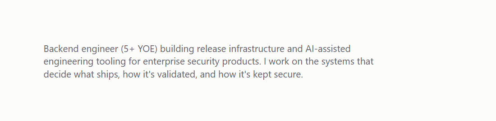
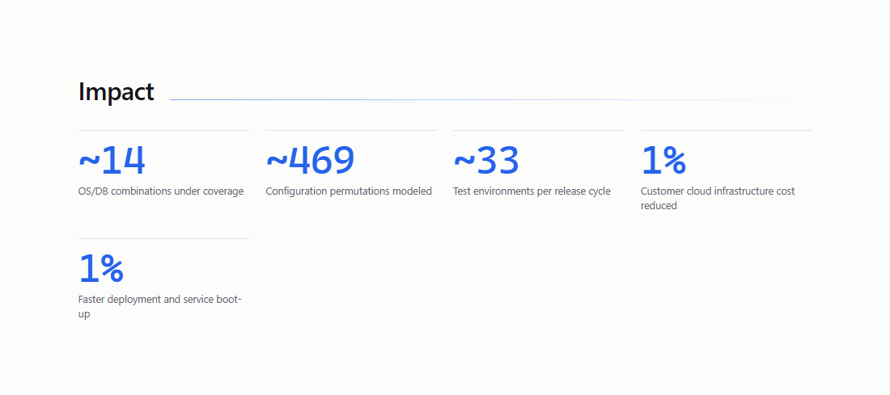
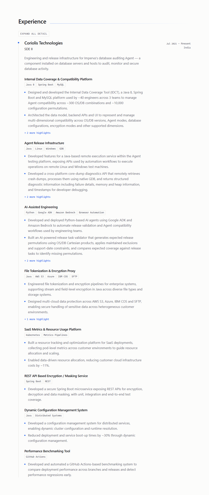
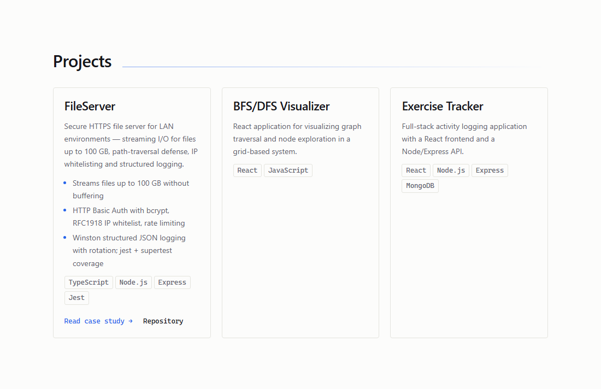
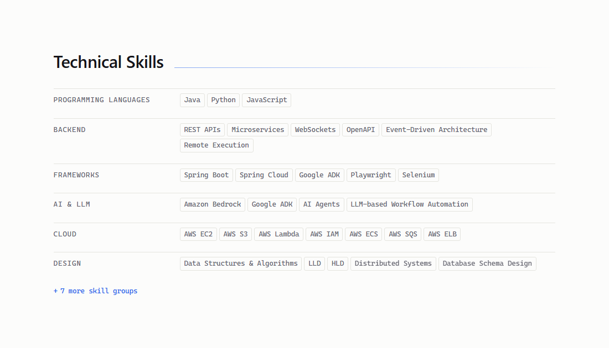
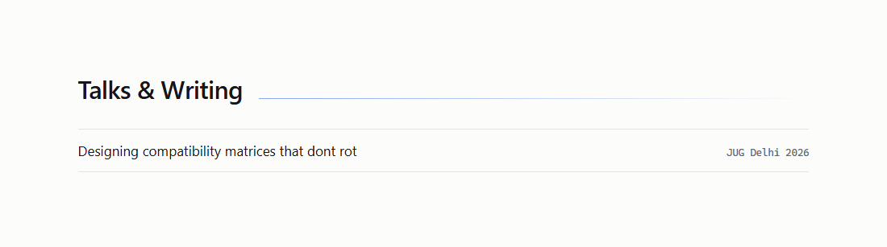
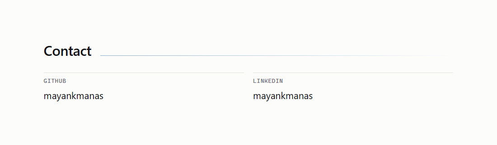

# Editing this site

Everything the site shows lives in two files. You will never open anything in `src/`.

```
content/resume.yaml     the facts   — what is true about you
content/site.yaml       the layout  — which sections appear, in what order
content/projects/*.md   case studies — long-form writing for flagship projects
```

---

## The 60-second version

1. Edit a file in `content/`.
2. Commit and push to `main`.
3. GitHub Actions validates, builds, regenerates the PDF, and deploys.
4. Live in about two minutes.

If the content is wrong, **the build fails and the live site is left exactly as it was.**
You get a red ✗ on the commit, never a broken homepage. That is why validation is strict.

To see it before you push:

```bash
npm install     # first time only
npm run dev     # http://localhost:4321, reloads as you edit
```

## Before you push

Three commands, in increasing order of thoroughness. You will use the first two daily and the
third only when you want certainty.

| Command | Takes | What it is for |
|---|---|---|
| `npm run validate` | ~1 second | After any YAML edit. Catches nearly every content mistake and names the offending section. |
| `npm run dev` | instant, hot-reloads | To **see** the change. http://localhost:4321, updates as you save. |
| `npm run verify` | ~1 minute | Before pushing. Runs the exact gate CI runs. |

`npm run verify` is validate → type-check → build → browser smoke test, in the same order as
[.github/workflows/deploy.yml](.github/workflows/deploy.yml). **If it passes locally, the push
will not fail the build.** That is the whole point of it.

To look at the finished build exactly as it will be served — including `/resume.pdf` and
`/og.png`, which only exist after a build:

```bash
npm run build && npm run preview     # http://localhost:4321
```

---

## Recipes

Every one of these is a content edit. None of them touches `src/`.

### Add a highlight to an existing workstream

`content/resume.yaml` → find the workstream → add a line to `highlights`:

```yaml
      - name: AI-Assisted Engineering
        tech: [Python, Google ADK, Amazon Bedrock, Browser Automation]
        highlights:
          - >-
            Developed and deployed Python-based AI agents using Google ADK and
            Amazon Bedrock to automate release validation.
          - >-
            Your new highlight goes here. Use >- for anything longer than a
            line: it folds the wrapped lines back into one paragraph.
```

The first **two** highlights of each workstream show on the page; the rest sit behind a
"+ N more highlights" toggle. All of them are in the HTML either way, and all of them are
in the PDF — the toggle is presentation only.

### Add a workstream

Same file, under the employer's `workstreams`:

```yaml
      - name: Name of the programme of work
        tech: [Java, Kafka]           # optional, renders as chips
        highlights:
          - At least one highlight is required.
```

### Add a job

`content/resume.yaml` → `work`. New jobs go **first** — the list renders in order:

```yaml
work:
  - company: New Employer
    position: Senior SDE
    client: Their Client        # optional, renders as a subtitle
    location: Bengaluru         # optional
    startDate: "2027-01"        # quote it
    endDate: null               # null renders as "Present"
    summary: >-                 # optional
      One paragraph on what the team does.
    workstreams:
      - name: First programme of work
        tech: [Go]
        highlights:
          - Something you did.
```

**When you add a job, set the previous job's `endDate`** from `null` to its real end month.
Two jobs both showing "Present" is the most likely mistake here, and nothing catches it for
you — it is valid content, just untrue.

### Add a skill

`content/resume.yaml` → `skills` → add to a group's `keywords`, or add a group:

```yaml
  - group: Observability
    priority: primary     # primary = expanded | secondary = behind "more skill groups"
    keywords: [OpenTelemetry, Jaeger]
```

`priority` affects the website only. All groups always appear in the HTML and in the PDF.

### Add a project (card only)

`content/resume.yaml` → `projects`:

```yaml
  - name: Thing I Built
    blurb: >-
      One or two sentences on what it is.
    stack: [Go, Postgres]
    highlights:              # optional bullets on the card
      - Handles 10k req/s
    links:
      repo: https://github.com/you/thing
```

### Add a project **with** a case study

Two steps, and the build enforces both.

1. Add the project as above, **plus a `slug`**:

```yaml
    slug: thing-i-built      # lowercase, digits and hyphens only
```

2. Create `content/projects/thing-i-built.md` — the filename must match the slug:

```markdown
---
title: Thing I Built
summary: >-
  One sentence. Used as the page description and the search-result snippet.
stack: [Go, Postgres]
role: Sole author          # optional
published: true            # false keeps it out of the build without deleting it
---

## Problem

What was actually wrong.

## Constraints

What you could not do, and why.

## Decisions that mattered

The part hiring managers read. Not what you built — what you *chose*, and what
the alternative would have cost.

## Outcome

## What I'd change
```

A slug with no file, or a file with no slug, **fails the build** and tells you which is missing.

### Add a brand-new section

`content/site.yaml` → append to `sections`. This needs **no code at all**:

```yaml
  - id: talks
    title: Talks & Writing
    layout: list
    items:
      - label: Designing compatibility matrices that don't rot
        meta: JUG Delhi · Nov 2026
        href: https://example.com/talk
      - label: Human-in-the-loop safeguards for data-mutating agents
        meta: Internal tech talk · 2026
```

It appears on the page and in the side navigation automatically.

### Reorder the site

Move entries around in `site.yaml` → `sections`. That is the whole operation.

### Hide something

- **A whole section** — delete its entry from `sections`, or comment it out with `#`.
- **A section, temporarily** — set its `items: []`. It vanishes cleanly: no heading, no gap.
- **A case study, not the project** — set `published: false` in the markdown frontmatter, and
  remove the `slug` from `resume.yaml` (otherwise the slug has no published file and the build
  fails).

### Change the accent colour

`content/site.yaml` → `theme.accent`. One hex value, used everywhere.

---

## Field reference

### `resume.yaml`

| Field | Required | Notes |
|---|---|---|
| `basics.name` | yes | |
| `basics.label` | yes | The short line under your name |
| `basics.headline` | yes | The claim the site argues. Rendered by the `about` section. |
| `basics.email` | yes | Rendered as a real `mailto:` link, unobfuscated |
| `basics.phone` | no | **Public** — appears in the HTML and the PDF |
| `basics.location.country` | yes | `city` and `region` optional |
| `basics.availability` | no | The "open to" line above the fold |
| `basics.profiles[]` | yes | `network`, `url`, optional `username` |
| `work[].startDate` | yes | `"YYYY-MM"`, **quoted** |
| `work[].endDate` | yes | A quoted date, or `null` for "Present" |
| `work[].client` | no | Renders as a subtitle under the company |
| `work[].workstreams[]` | yes | At least one, each with at least one highlight |
| `education[].awards` | no | Defaults to an empty list |
| `skills[].priority` | no | `primary` or `secondary`; defaults to `secondary` |
| `projects[].slug` | no | **Its presence is what creates a case study page** |
| `projects[].links.repo` | no | A URL, or the literal `TODO` |

**`TODO`** is understood everywhere. A field set to `TODO` is treated as missing rather than
rendered: a `TODO` repo URL produces no link instead of a link that 404s, and a `TODO` profile
is dropped from the contact section. Outstanding `TODO`s are listed in a notice under your name
on the homepage, so they cannot quietly ship. Fill the value and the notice disappears.

**Quote your dates.** `"2021-07"`, not `2021-07`. Not strictly required by this parser, but it
keeps every date looking the same and survives a future parser change.

### `site.yaml`

| Field | Notes |
|---|---|
| `meta.title` | Browser tab and the `Name — Role` pattern used on subpages |
| `meta.description` | The search-result snippet |
| `meta.url` | The canonical site URL. **Set this once the site has a real address.** |
| `theme.accent` | Hex colour |
| `theme.mode` | `system` (default), `light`, or `dark` — the *initial* default only |
| `sections[].id` | Lowercase, digits, hyphens. Must be unique; it is the anchor link. |
| `sections[].title` | The heading, or `null` to render with no heading |
| `sections[].layout` | One of the seven below |
| `sections[].source` | A dotted path into `resume.yaml` — e.g. `work`, `basics.headline` |
| `sections[].items` | Inline data instead of a `source` |

Every section needs **exactly one** of `source` or `items`. Both, or neither, fails the build.

---

## Layout catalogue

Seven layouts. A new *section* needs no code; only a genuinely new visual treatment does.

### `prose` — a block of text



```yaml
  - id: about
    title: null
    layout: prose
    source: basics.headline
```

Blank lines separate paragraphs. Plain text — no markdown formatting is applied.

### `metrics` — large figures



```yaml
  - id: impact
    title: Impact
    layout: metrics
    items:
      - label: OS/DB combinations under coverage
        value: "~300"
      - label: Configuration permutations modeled
        value: "~10,000"
```

Figures count up when scrolled into view. They render at their final value, so they are
correct with JavaScript disabled.

### `timeline` — spine-threaded entries



```yaml
  - id: experience
    title: Experience
    layout: timeline
    source: work        # also accepts: education
```

The only layout that reads two different shapes. Work entries show nested workstreams with
progressive disclosure; education entries show awards.

### `cards` — a project grid



```yaml
  - id: projects
    title: Projects
    layout: cards
    source: projects
```

A `slug` on a project turns its card into a case-study link.

### `tags` — labelled rows of chips



```yaml
  - id: skills
    title: Technical Skills
    layout: tags
    source: skills
```

No percentage bars, deliberately: "React 85%" is a number with no referent.

### `list` — label, meta, optional link



```yaml
  - id: talks
    title: Talks & Writing
    layout: list
    items:
      - label: Designing compatibility matrices that don't rot
        meta: JUG Delhi · Nov 2026
        href: https://example.com/talk
```

The general-purpose layout. Talks, writing, awards, certifications, anything that is a
labelled row. Reach for this before asking for a new layout.

### `contact` — profile links



```yaml
  - id: contact
    title: Contact
    layout: contact
    source: basics.profiles
```

---

## Editing from your phone

Yes, entirely. Use **github.com in a mobile browser** — not the GitHub app, whose editor is poor.
The `.` shortcut that opens github.dev needs a physical keyboard, so use the pencil instead.

### The safe flow: edit, PR, check, merge

1. Open `content/resume.yaml` on github.com.
2. Tap the **pencil** icon and make your edit.
3. At the bottom choose **"Create a new branch and start a pull request"**.
4. Open the PR. **CI runs the full gate on it** — validate, type-check, build, browser smoke test,
   PDF text-layer check. Watch the tick on the PR page.
5. CI also publishes a **preview** at `<branch>.mayankmanas.pages.dev`. Open it on your phone and
   look at the actual rendered change.
6. Green tick and preview looks right → **Merge**. That pushes to `main`, which redeploys the
   live site. Two minutes.
7. Red ✗ → open the failed run, read the error, edit the branch again. **The live site is
   untouched the whole time.**

### The fast flow: commit straight to main

At step 3, choose "Commit directly to the `main` branch" instead. Same validation, same
protection — a bad edit still fails the build and leaves the live site alone — you just skip the
preview and find out afterwards rather than before.

Use the PR flow when you want to *see* it first. Use the direct flow for a typo.

> **One thing to know:** pushing a branch **without** opening a PR runs nothing at all — no
> validation, no preview. Opening the PR is what triggers it.

---

## When it breaks

The build fails and the error names the file and the offending section. The four you will
actually hit:

**`section "experience": source "works" does not resolve`**
A typo in a `source` path. The error suggests the nearest match and lists every valid path.

**`section "experience" -> layout: Invalid discriminator value`**
A misspelled `layout`. The error lists the seven valid values.

**`layout "timeline" expects a list of work entries {...} but source "skills" resolved to a
list whose entries have keys: group, priority, keywords`**
Right layout, right path, wrong pairing. `timeline` reads `work` or `education`; `tags` reads
`skills`.

**`project "FileServer": declares slug "fileserver" but content/projects/fileserver.md does
not exist`**
You added a slug without the file, or renamed one and not the other.

**`links: Invalid input: expected object, received null`**
You deleted or commented out a value but left its parent key behind. YAML turns a key with
nothing under it into `null`, and optional means *absent*, not *null*. Delete the parent too:

```yaml
    links:                 # <- this line must go as well
      repo: https://...    # <- not just this one
```

Also common: **`Unrecognized key: "hilights"`** — a misspelled field name. Unknown fields are
rejected rather than silently ignored, because a silently ignored `hilights:` means your new
bullets never appear and nothing tells you why.

---

## The rule

**If you are opening anything in `src/`, stop.**

Either it is a content edit — and it belongs in `content/` — or it is a genuinely new visual
treatment, which is the one case that needs code. Adding a layout means editing exactly two
files: `src/lib/schema.ts` (declare it and the shape of the data it reads) and
`src/components/sections/index.ts` (say what renders it). The type system enforces that pair:
add one without the other and it will not compile.

There is one other exception, and it is deliberate: the **résumé PDF's section order** is
fixed in `src/pages/resume.astro`. ATS parsers look for the literal headings `WORK EXPERIENCE`
/ `TECHNICAL SKILLS` / `PROJECTS` / `EDUCATION` in a conventional order, so that is a
compatibility requirement rather than a design choice. Adding a new *kind* of résumé section
is the one content change that also needs code.

---

## Regenerating the screenshots in this guide

```bash
npm run build
npm run screenshots
```

The `list` layout image requires a section using it; uncomment the `talks` example in
`site.yaml` before running, if you have removed it.
